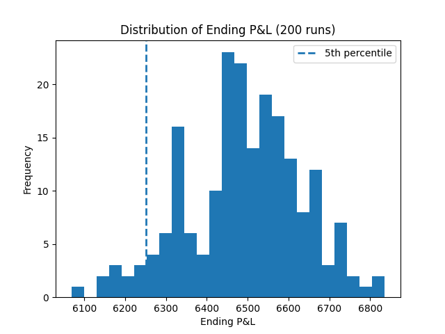

#EV Simulator
Simple Python simulation of expected value and drawdowns for a probability-based strategy

This short project simulates a probability-based simulation to compare theoretical expected value with realized outcomes over many trials.
The simulator created tracks:
  - Theoretical expected value per trade
  - Simulated expected value per trade
  - Total profit
  - Simulated win rate
  - Max drawdown

Inputs include:
  - Probability of a win
  - Win amount unit
  - Loss amount unit
  - Total number of trials

What concept this reinforced:
  - Variance affects any strategy you put into place, even ones with high or positive expected value.

#Histogram
To better understand risk beyond average expected value dont above, the simulator was run multiple times and the P&L was collected. The histogram below shows that even with positive EV, results can vary widely due to randomness. The 5th percentile P&L shows the worst 5% of simulations. This is considered to be the worst-case outcomes.

Histogram: 
